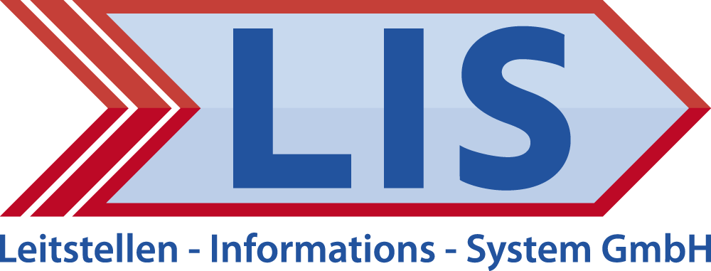

# LIS GmbH

## About us

For more than 30 years, LIS GmbH has been offering software for private and public security.

A broad, consistent product range offers our users the possibility to use many processes with one system.

* Dispatching/alerting with interfaces to external systems
* Operation documentation with accounting
* Personnel management with duty scheduling
* Equipment and material management
* Watch book for documentation of all events during a shift
* Activity report for recording and documenting all tasks of the
organization
* Emergency management
* and much more.

In addition to standard products, we develop individually customized solutions - based on our standard products - and thus offer a high degree of investment security.

## We're hiring

We're always looking for new talents. Currently we offer the following vacancies:

* Full-Stack-Developer (.NET-Framework 4.8, ASP.Net-Core 6, SQL, Angular, Docker)

Feel free to send us your CV at [info(at)lis-gmbh.com](mailto:info@lis-gmbh.com).
